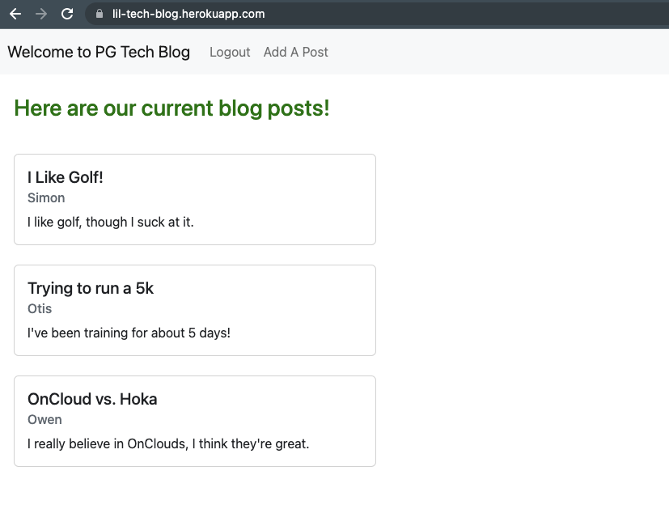

# Tech Blog

A blog where developers can publish their blog posts.

## Installation
Download/clone repository
This app requires node.js
Do npm install to install the required npm dependecies
Then npm start to run locally on your machine

## Usage
2 terminals 

1 is mysql 
login: mysql -u  root -p 
enter pw: root

then run source db/schema.sql

switch to new term

2 npm run seed
node server.js

## User Story
AS A developer who writes about tech
I WANT a CMS-style blog site
SO THAT I can publish articles, blog posts, and my thoughts and opinions

## Screenshots

## Links
Deployed link: https://lil-tech-blog.herokuapp.com/

Github link: https://github.com/pgamboa322/tech-blog